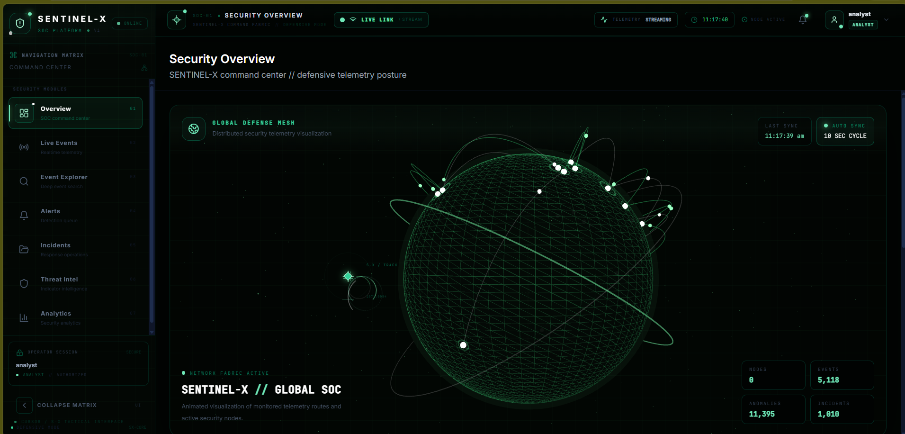
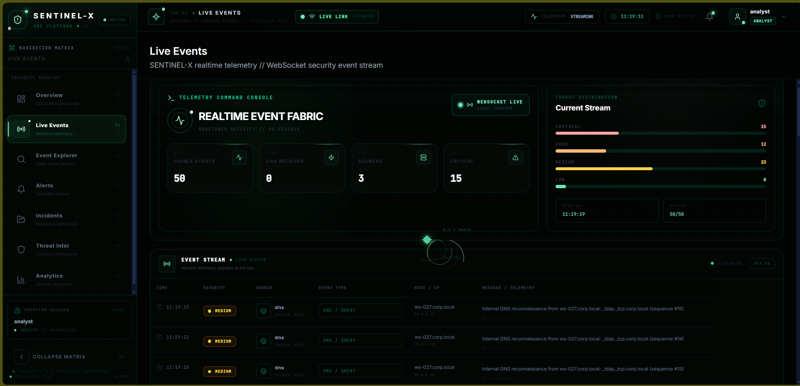
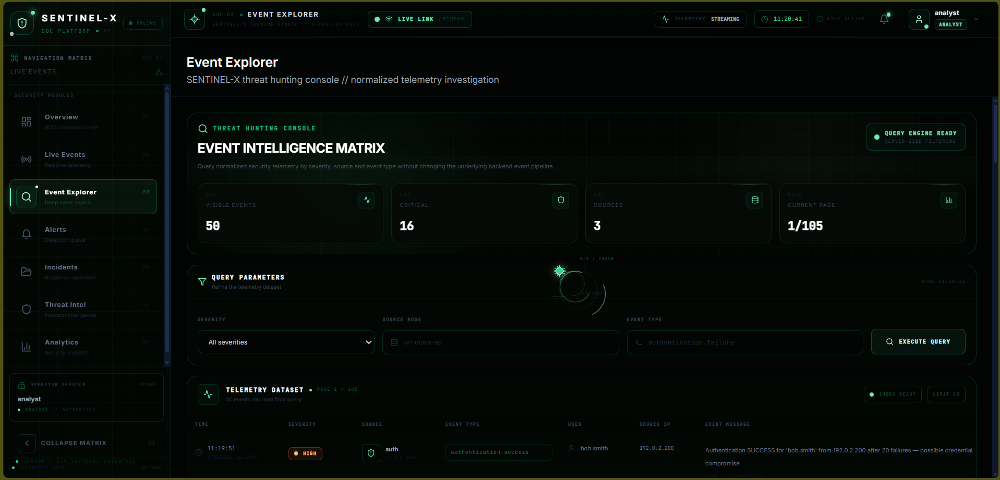
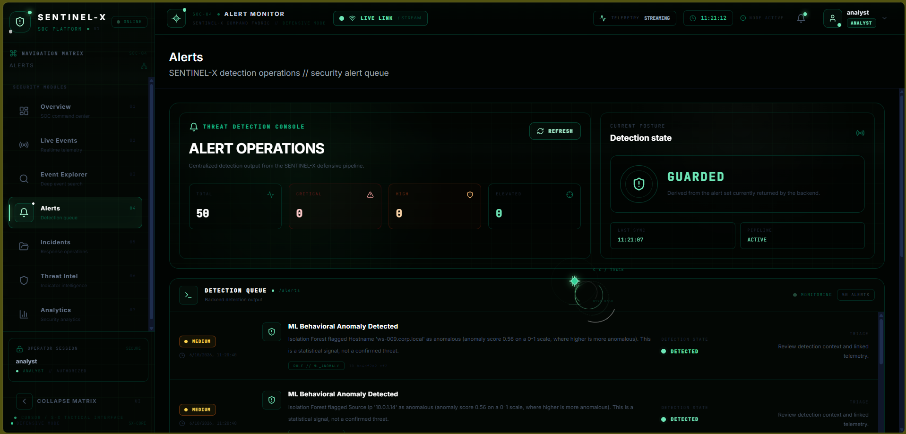
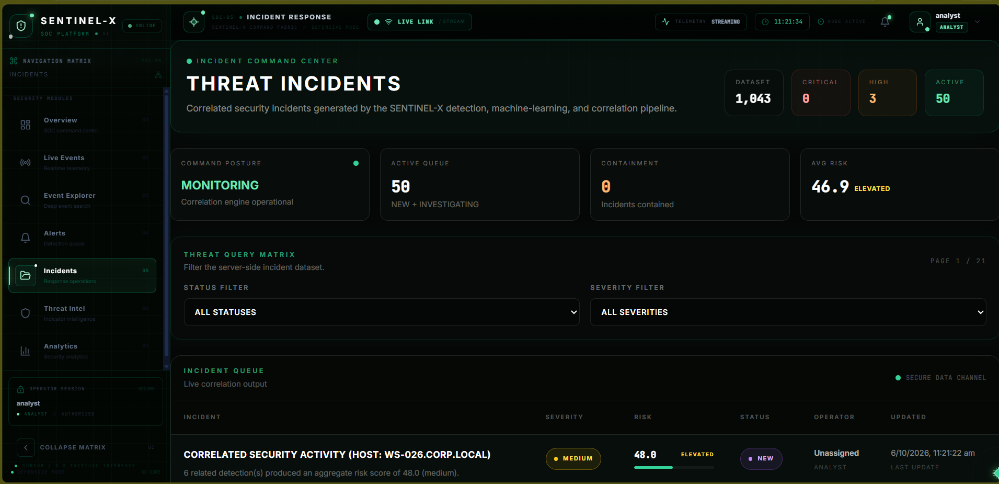
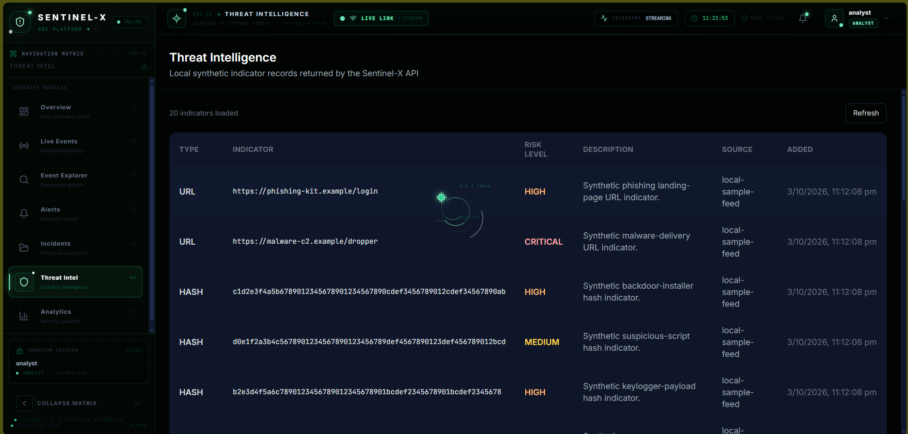
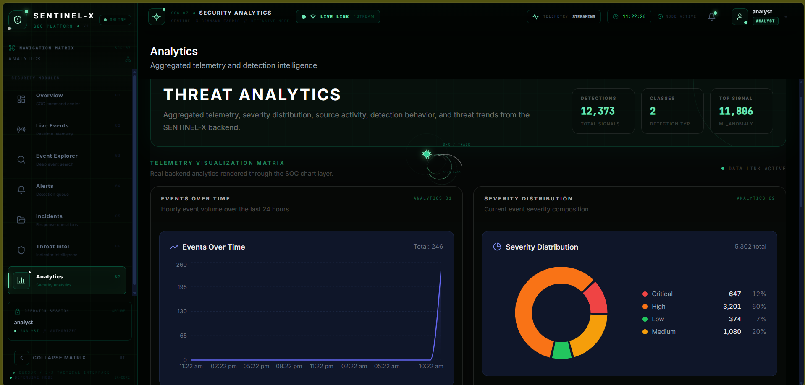
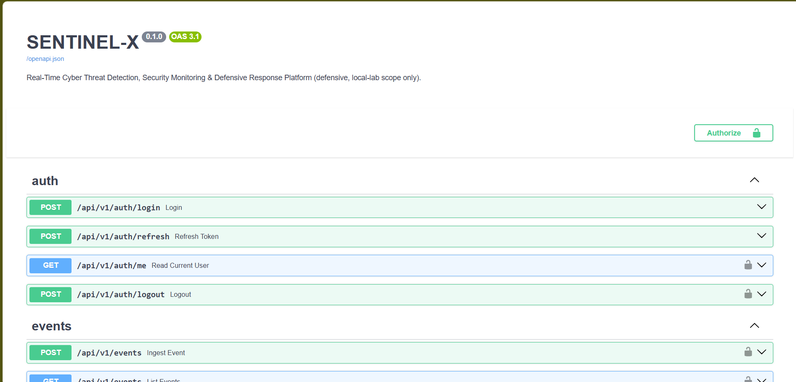

# SENTINEL-X

### Real-Time Cyber Threat Detection, Security Monitoring & Defensive Response Platform

> **SENTINEL-X is a defensive, SOC-style cybersecurity platform that transforms raw security telemetry into detections, risk intelligence, incidents, and real-time analyst visibility.**

---

# 🚀 SENTINEL-X IN ACTION

> The following screenshots were captured from the running SENTINEL-X development environment, demonstrating the actual SOC interface, security telemetry, detections, incident management, analytics, and backend API.

## 🖥️ Security Overview

<p align="center">
  
</p>

> The Security Overview provides the main SENTINEL-X SOC command center with global security visualization, telemetry status, monitored activity, anomalies, and incidents.

---

## ⚡ Live Events

<p align="center">
  
</p>

> Live Events provides real-time visibility into incoming security telemetry and processed events.

---

## 🔍 Event Explorer

<p align="center">
  
</p>

> Event Explorer provides an analyst-focused interface for searching, filtering, and investigating security events.

---

## 🚨 Security Alerts

<p align="center">
  
</p>

> The Alerts interface presents detections generated by the SENTINEL-X detection pipeline and provides security context for analyst investigation.

---

## 🛡️ Incident Management

<p align="center">
  
</p>

> The Incidents interface provides visibility into security incidents created from correlated detections and events.

---

## 🌐 Threat Intelligence

<p align="center">
  
</p>

> Threat Intelligence provides visibility into security indicators including IP addresses, domains, hashes, and URLs.

---

## 📊 Security Analytics

<p align="center">
  
</p>

> Analytics provides visual insight into security activity, including event trends, severity distribution, detection information, and other security metrics.

---

## 🔌 Backend API

<p align="center">
  
</p>

> The backend API is exposed through an interactive FastAPI documentation interface for interacting with SENTINEL-X services.

---

# 🧭 SENTINEL-X Processing Flow

```text
Security Telemetry
        ↓
     Ingestion
        ↓
Validation & Normalization
        ↓
     Enrichment
        ↓
 Detection Engine
        ↓
   Correlation
        ↓
   Risk Scoring
        ↓
     Incident
        ↓
Defensive Response
        ↓
   SOC Dashboard
   
**SENTINEL-X** is a full-stack Security Operations Center (SOC) platform designed to demonstrate how modern security monitoring systems process telemetry from ingestion to analyst response.

Instead of displaying hardcoded alerts, SENTINEL-X implements an actual security pipeline:

```text
Telemetry
   ↓
Ingestion
   ↓
Validation & Normalization
   ↓
Enrichment
   ↓
Rule-Based Detection ─────┐
                          ├──→ Correlation
ML Anomaly Detection ────┘
                               ↓
                         Risk Scoring
                               ↓
                         Incident Creation
                               ↓
                    Defensive Response Simulation
                               ↓
                    Real-Time SOC Dashboard
```

The platform combines **cybersecurity engineering, backend development, machine learning, data processing, real-time systems, and security visualization** into one integrated project.

---

## 🛡️ What is SENTINEL-X?

SENTINEL-X is a local Security Operations Center (SOC) platform capable of receiving and processing multiple categories of security telemetry, including:

* Authentication activity
* Network connections
* DNS queries
* Endpoint/process activity
* Firewall events
* Simulated security incidents

The platform processes these events through multiple security layers.

### Detection Pipeline

```text
Raw Event
   │
   ▼
Ingestion
   │
   ▼
Validation
   │
   ▼
Normalization
   │
   ▼
Enrichment
   │
   ├───────────────┐
   ▼               ▼
Rule Engine      ML Engine
   │               │
   └───────┬───────┘
           ▼
      Correlation
           │
           ▼
      Risk Scoring
           │
           ▼
       Incident
           │
           ▼
 Response Simulation
           │
           ▼
   Analyst Dashboard
```

Every major alert, detection, incident, and risk score displayed by the dashboard originates from processed telemetry rather than static frontend data.

---

# ⚡ Why SENTINEL-X?

Traditional beginner cybersecurity projects often stop at:

```text
Log → Alert
```

SENTINEL-X goes further:

```text
Log
 ↓
Understand the event
 ↓
Normalize the data
 ↓
Detect suspicious behavior
 ↓
Apply ML anomaly analysis
 ↓
Correlate related activity
 ↓
Calculate risk
 ↓
Create an incident
 ↓
Explain why it happened
 ↓
Allow analyst investigation
 ↓
Simulate defensive response
 ↓
Visualize everything in real time
```

This makes SENTINEL-X a practical demonstration of how components found in modern **SIEM / SOC / XDR-style workflows** can be designed and integrated.

---

# 🚀 Key Capabilities

## 🔐 Authentication & RBAC

* JWT-based authentication
* Access and refresh tokens
* Role-based access control
* ADMIN / ANALYST / VIEWER roles
* Protected API endpoints
* WebSocket authentication
* Login/logout auditing

---

## 📥 Security Telemetry Ingestion

SENTINEL-X accepts multiple telemetry categories:

| Category       | Examples                                  |
| -------------- | ----------------------------------------- |
| Authentication | Login failures, successful authentication |
| Network        | Connections, ports, connection failures   |
| DNS            | Queries, suspicious domains               |
| Endpoint       | Process execution and abnormal activity   |
| Firewall       | Network security events                   |

Incoming telemetry is validated and converted into a canonical internal representation before detection.

---

# 🧠 Detection Engine

SENTINEL-X contains an extensible rule-based detection engine.

Current detection rules include:

```text
AUTH_REPEATED_FAILURES
AUTH_BRUTE_FORCE
AUTH_SUCCESS_AFTER_FAILURES

NET_HIGH_CONNECTION_FREQUENCY
NET_SUSPICIOUS_PORT
NET_REPEATED_CONN_FAILURES

ENDPOINT_SUSPICIOUS_PROCESS
ENDPOINT_ABNORMAL_EXEC_RATE

FILE_UNUSUAL_ACTIVITY

DNS_EXCESSIVE_QUERIES
DNS_SUSPICIOUS_DOMAIN_PATTERN
```

The detection engine evaluates incoming events and produces structured detections containing information such as:

* Detection type
* Severity
* Confidence
* Source information
* Related event
* Detection rule
* Explanation

---

# 🤖 ML Anomaly Detection

SENTINEL-X also contains a machine-learning anomaly detection layer.

### Model

**Isolation Forest**

The ML pipeline extracts numerical features from telemetry and evaluates whether observed behavior deviates from the learned baseline.

```text
Telemetry
    ↓
Feature Extraction
    ↓
Baseline Analysis
    ↓
Isolation Forest
    ↓
Anomaly Score
    ↓
Risk / Detection Pipeline
```

The ML subsystem is intentionally explainable and integrated into the broader detection pipeline rather than functioning as an isolated model demonstration.

---

# 🔗 Event Correlation

Individual events do not always represent an attack by themselves.

SENTINEL-X correlates related detections and events to identify broader security activity.

For example:

```text
Multiple Login Failures
        ↓
Successful Login
        ↓
Suspicious Network Activity
        ↓
Endpoint Activity
        ↓
Correlated Security Incident
```

This allows analysts to investigate activity as an incident rather than viewing thousands of unrelated alerts.

---

# 🎯 Risk Scoring

SENTINEL-X calculates transparent risk scores using security factors such as:

* Detection severity
* Event characteristics
* Threat indicators
* Correlation context
* Anomaly information
* Asset importance

The goal is not simply to say:

> "Something is suspicious."

The platform attempts to answer:

> **"How serious is this activity, and why?"**

---

# 🚨 Incident Management

Detections can be associated with incidents.

Supported incident states include:

```text
NEW
INVESTIGATING
CONTAINED
RESOLVED
FALSE_POSITIVE
```

Analysts can investigate incidents, inspect associated detections/events, evaluate risk, update status, and trigger simulated response actions.

---

# 🛠️ Defensive Response Simulation

SENTINEL-X includes simulation-only response actions such as:

```text
INVESTIGATE_SOURCE_IP
REVIEW_AUTH_LOGS
ISOLATE_ENDPOINT
DISABLE_ACCOUNT
ROTATE_CREDENTIALS
BLOCK_INDICATOR
INCREASE_MONITORING
COLLECT_TELEMETRY
```

These actions **do not perform real destructive or offensive operations**.

They represent what a SOC response workflow could look like in an authorized training environment.

---

# 🌐 Real-Time Monitoring

The platform uses **WebSockets** for real-time security event delivery.

The Live Events interface receives newly processed events without requiring a full page refresh.

```text
Event Generated
      ↓
Backend Pipeline
      ↓
Detection / Processing
      ↓
WebSocket Manager
      ↓
Connected Analysts
      ↓
Live SOC Dashboard
```

The dashboard displays the realtime connection state and incoming telemetry.

---

# 📊 SOC Dashboard

The frontend provides multiple analyst-focused modules.

### Overview

Provides a high-level security posture including:

* Total events
* Detection activity
* Incident activity
* Risk information
* Threat posture
* Realtime security activity

### Live Events

Real-time telemetry monitoring using WebSockets.

### Event Explorer

Security event investigation with filtering and pagination.

### Alerts

Detection and alert visibility.

### Incidents

Incident investigation and response workflow.

### Incident Detail

Detailed incident investigation including:

* Incident metadata
* Risk
* Detections
* Related events
* Response actions
* Investigation controls

### Analytics

Security analytics including:

* Events over time
* Severity distribution
* Top sources
* Detection types

### Threat Intelligence

Indicator management for:

* IP addresses
* Domains
* Hashes
* URLs

### System Health

Monitoring of:

* Backend status
* Database connectivity
* Ingestion pipeline
* Detection pipeline
* ML subsystem
* Realtime services

---

# 🖥️ SENTINEL-X Hacker Edition

The interface is designed as a tactical SOC/HUD rather than a conventional admin dashboard.

Visual features include:

* Obsidian + Emerald + White visual system
* Tactical HUD components
* 3D threat visualization
* Interactive global threat globe
* Network connection visualization
* Realtime telemetry indicators
* Tactical sidebar
* Security operation status
* Global tactical cursor
* Realtime WebSocket status
* Analyst session indicators
* Animated security interface elements

The visual layer is intentionally designed to make the project feel like an operational security console while keeping the underlying system functional.

---

# 🧱 Technology Stack

| Layer                | Technology              |
| -------------------- | ----------------------- |
| Frontend             | React 18                |
| Language             | TypeScript              |
| Build Tool           | Vite                    |
| Styling              | Tailwind CSS            |
| Visualization        | Recharts                |
| 3D Visualization     | Three.js                |
| Backend              | Python 3.11             |
| API                  | FastAPI                 |
| ORM                  | SQLAlchemy 2.0 Async    |
| Database             | PostgreSQL 15           |
| Migrations           | Alembic                 |
| Authentication       | JWT + bcrypt            |
| Realtime             | WebSockets              |
| Machine Learning     | scikit-learn            |
| ML Algorithm         | Isolation Forest        |
| Numerical Processing | NumPy / pandas          |
| Testing              | Pytest                  |
| Infrastructure       | Docker / Docker Compose |

---

# 🏗️ Architecture

```text
                         ┌──────────────────────┐
                         │   Security Sources   │
                         │ Auth / DNS / Network │
                         │ Endpoint / Firewall │
                         └──────────┬───────────┘
                                    │
                                    ▼
                         ┌──────────────────────┐
                         │      Ingestion       │
                         └──────────┬───────────┘
                                    │
                                    ▼
                         ┌──────────────────────┐
                         │ Validation /         │
                         │ Normalization        │
                         └──────────┬───────────┘
                                    │
                                    ▼
                         ┌──────────────────────┐
                         │      Enrichment      │
                         └──────────┬───────────┘
                                    │
                    ┌───────────────┴───────────────┐
                    ▼                               ▼
          ┌──────────────────┐             ┌──────────────────┐
          │ Detection Engine │             │   ML Anomaly     │
          │   Rule Based     │             │     Engine       │
          └────────┬─────────┘             └────────┬─────────┘
                   │                                │
                   └───────────────┬────────────────┘
                                   ▼
                         ┌──────────────────────┐
                         │ Correlation Engine   │
                         └──────────┬───────────┘
                                    │
                                    ▼
                         ┌──────────────────────┐
                         │    Risk Scoring      │
                         └──────────┬───────────┘
                                    │
                                    ▼
                         ┌──────────────────────┐
                         │ Incident Management  │
                         └──────────┬───────────┘
                                    │
                                    ▼
                         ┌──────────────────────┐
                         │ Defensive Response   │
                         │     Simulation       │
                         └──────────┬───────────┘
                                    │
                                    ▼
                         ┌──────────────────────┐
                         │   Analyst Dashboard  │
                         │ React + WebSocket    │
                         └──────────────────────┘
```

---

# 📁 Project Structure

```text
SENTINEL-X/
│
├── backend/
│   ├── app/
│   │   ├── api/
│   │   ├── core/
│   │   ├── correlation/
│   │   ├── detection/
│   │   ├── ingestion/
│   │   ├── ml/
│   │   ├── models/
│   │   ├── risk/
│   │   ├── schemas/
│   │   └── services/
│   │
│   ├── alembic/
│   ├── tests/
│   ├── Dockerfile
│   └── requirements.txt
│
├── database/
│   └── seed/
│       ├── seed_assets.py
│       ├── seed_indicators.py
│       ├── seed_rules.py
│       └── seed_users.py
│
├── frontend/
│   ├── src/
│   │   ├── components/
│   │   ├── context/
│   │   ├── hooks/
│   │   ├── pages/
│   │   ├── services/
│   │   ├── tests/
│   │   └── types/
│   ├── Dockerfile
│   └── package.json
│
├── simulator/
│   ├── scenarios/
│   ├── client.py
│   └── simulator.py
│
├── scripts/
│   ├── reset_db.sh
│   ├── run_migrations.sh
│   ├── run_simulator.sh
│   ├── run_tests.sh
│   └── start.sh
│
├── docs/
│   ├── API.md
│   ├── ARCHITECTURE.md
│   ├── DEPLOYMENT.md
│   ├── DETECTION_ENGINE.md
│   ├── ML.md
│   ├── PROJECT_STRUCTURE.md
│   ├── SECURITY.md
│   └── TESTING.md
│
├── docker-compose.yml
├── .env.example
├── .gitignore
├── LICENSE
└── README.md
```

---

# ⚙️ Installation & Execution

## Requirements

Install the following before running SENTINEL-X:

* Docker Desktop
* Git
* Windows 10/11 or Linux/macOS
* At least 8 GB RAM recommended

The application itself runs inside Docker containers, so Python and Node.js do not need to be manually configured for the normal Docker workflow.

---

# 🚀 Quick Start

## 1. Clone the repository

```bash
git clone https://github.com/vardhan0666/SENTINEL-X.git
cd SENTINEL-X
```

---

## 2. Start SENTINEL-X

Run:

```bash
docker compose up -d --build
```

This starts:

```text
PostgreSQL
Backend API
Frontend
```

Check container status:

```bash
docker compose ps
```

Expected core services:

```text
sentinelx-postgres
sentinelx-backend
sentinelx-frontend
```

---

# 🌐 3. Open the Platform

Frontend:

```text
http://localhost:5173
```

Backend:

```text
http://localhost:8000
```

Swagger API documentation:

```text
http://localhost:8000/docs
```

Health endpoint:

```text
http://localhost:8000/api/v1/health
```

---

# 🔐 4. Login

For local development/demo use:

```text
Username: analyst
Password: analyst-sentinelx-dev
```

These credentials are intended only for the local demonstration environment.

Do **not** expose the development environment publicly with demo credentials.

---

# 🤖 5. Start the Security Event Simulator

SENTINEL-X includes a telemetry simulator that generates realistic synthetic security activity.

Run:

```bash
docker compose --profile simulation up -d simulator
```

The simulator generates scenarios such as:

```text
Normal Baseline
      ↓
Brute Force
      ↓
Account Compromise
      ↓
Network Anomaly
      ↓
DNS Anomaly
      ↓
Repeat
```

The events flow through the actual SENTINEL-X detection pipeline.

You can therefore observe the complete process:

```text
Simulator
   ↓
API
   ↓
Ingestion
   ↓
Detection
   ↓
Correlation
   ↓
Risk
   ↓
Incident
   ↓
Dashboard
```

---

# 🔎 6. Verify the System

Check running containers:

```bash
docker compose ps
```

Check backend logs:

```bash
docker compose logs backend --tail=100
```

Check frontend logs:

```bash
docker compose logs frontend --tail=100
```

Check simulator logs:

```bash
docker compose logs simulator --tail=100
```

Check API health:

```bash
curl http://localhost:8000/api/v1/health
```

---

# 🧪 Testing

SENTINEL-X includes a backend regression test suite.

Run:

```bash
docker compose exec backend python -m pytest -q
```

The test suite covers areas including:

* Authentication
* API events
* Detection rules
* Correlation
* Incident management
* ML anomaly detection
* Normalization
* Risk scoring
* Validation
* Current system integration

Frontend static checks:

```bash
cd frontend
npm run type-check
npm run lint
npm run build
```

Return to the project root afterward:

```bash
cd ..
```

---

# 🧹 Stop the Platform

Stop all services:

```bash
docker compose down
```

Stop the simulator profile:

```bash
docker compose --profile simulation down
```

---

# 🔄 Restart the Platform

```bash
docker compose up -d
```

Start simulator again if required:

```bash
docker compose --profile simulation up -d simulator
```

---

# 🗄️ Database Operations

View PostgreSQL logs:

```bash
docker compose logs postgres --tail=100
```

Run database migrations:

```bash
docker compose exec backend alembic upgrade head
```

Reset the development database when required:

```bash
docker compose down -v
docker compose up -d --build
```

> **Warning:** `docker compose down -v` removes Docker volumes and therefore deletes the development database data.

---

# 📡 API

The backend API is organized under:

```text
/api/v1
```

Major API areas include:

```text
/auth
/events
/detections
/incidents
/alerts
/analytics
/indicators
/rules
/assets
/ml
/health
/ws
```

Interactive documentation is available at:

```text
http://localhost:8000/docs
```

---

# 🔌 WebSocket

SENTINEL-X provides an authenticated realtime event stream.

The frontend connects to:

```text
/api/v1/ws/events
```

The WebSocket connection is protected using the authenticated session token.

This powers the Live Events interface and realtime SOC status.

---

# 🧬 Detection Examples

The simulator can produce activity that results in detections such as:

### Authentication

```text
Repeated authentication failures
        ↓
Brute-force detection
        ↓
Successful login after failures
        ↓
Higher-risk activity
```

### Network

```text
Repeated connection attempts
        ↓
Connection-frequency analysis
        ↓
Suspicious network detection
```

### DNS

```text
High query volume
        ↓
DNS behavioral analysis
        ↓
Suspicious-domain detection
```

### Endpoint

```text
Process activity
        ↓
Execution-rate analysis
        ↓
Endpoint anomaly detection
```

---

# 🧠 Explainability

A major design principle of SENTINEL-X is that detections should not simply produce:

```text
THREAT DETECTED
```

Instead, the system maintains contextual information that allows an analyst to understand:

```text
WHAT happened?
      ↓
WHY was it detected?
      ↓
HOW severe is it?
      ↓
WHAT events are related?
      ↓
WHAT is the resulting risk?
      ↓
WHAT response could be taken?
```

This makes the platform useful as both a cybersecurity engineering demonstration and an analyst-training environment.

---

# 🔒 Security Scope

SENTINEL-X is strictly defensive.

The project is designed for:

* Local security labs
* Synthetic telemetry
* Authorized environments
* SOC training
* Detection engineering
* Security monitoring research
* Cybersecurity education

SENTINEL-X does **not** implement:

* Malware
* Exploit delivery
* Credential harvesting
* Unauthorized scanning
* Destructive actions
* Persistence mechanisms
* Real-world attack automation

Response actions are simulations intended to demonstrate SOC workflows.

See:

```text
docs/SECURITY.md
```

for the complete security scope.

---

# 🧪 Development Philosophy

SENTINEL-X was designed around several principles:

### Real Processing

Security data should pass through actual backend pipelines rather than being hardcoded into the UI.

### Explainability

Detection and risk decisions should be understandable to analysts.

### Modularity

Detection, ingestion, ML, correlation, risk, and response are separated into dedicated subsystems.

### Realtime Visibility

Security operations benefit from immediate telemetry and detection visibility.

### Defensive Design

The platform demonstrates security monitoring and response without implementing offensive functionality.

### Reproducibility

Docker Compose allows the complete development environment to be started consistently.

---

# 📈 Current System Capabilities

| Capability                    | Status |
| ----------------------------- | :----: |
| Dockerized infrastructure     |    ✅   |
| PostgreSQL database           |    ✅   |
| Async FastAPI backend         |    ✅   |
| JWT authentication            |    ✅   |
| Role-based access control     |    ✅   |
| Security telemetry ingestion  |    ✅   |
| Event normalization           |    ✅   |
| Rule-based detection          |    ✅   |
| ML anomaly detection          |    ✅   |
| Event correlation             |    ✅   |
| Risk scoring                  |    ✅   |
| Incident management           |    ✅   |
| Defensive response simulation |    ✅   |
| Threat intelligence           |    ✅   |
| Analytics                     |    ✅   |
| WebSocket realtime events     |    ✅   |
| Telemetry simulator           |    ✅   |
| Backend tests                 |    ✅   |
| React SOC dashboard           |    ✅   |
| Tactical/Hacker Edition UI    |    ✅   |
| API documentation             |    ✅   |
| Architecture documentation    |    ✅   |
| Security documentation        |    ✅   |

---

# 🧑‍💻 Development Commands

### Backend tests

```bash
docker compose exec backend python -m pytest -q
```

### Frontend type checking

```bash
cd frontend
npm run type-check
```

### Frontend linting

```bash
npm run lint
```

### Frontend production build

```bash
npm run build
```

### Backend logs

```bash
docker compose logs backend -f
```

### Frontend logs

```bash
docker compose logs frontend -f
```

### Simulator logs

```bash
docker compose logs simulator -f
```

---

# 📚 Documentation

Detailed documentation is available in the `docs/` directory.

| Document               | Purpose                          |
| ---------------------- | -------------------------------- |
| `API.md`               | API endpoints and contracts      |
| `ARCHITECTURE.md`      | System architecture              |
| `DEPLOYMENT.md`        | Deployment information           |
| `DETECTION_ENGINE.md`  | Detection architecture and rules |
| `ML.md`                | Machine-learning subsystem       |
| `PROJECT_STRUCTURE.md` | Codebase organization            |
| `SECURITY.md`          | Defensive security scope         |
| `TESTING.md`           | Testing strategy                 |

---

# 🎓 What This Project Demonstrates

SENTINEL-X brings together multiple Computer Science and cybersecurity disciplines:

```text
Cybersecurity
     +
Backend Engineering
     +
Frontend Engineering
     +
Machine Learning
     +
Database Engineering
     +
Networking
     +
Real-Time Systems
     +
Authentication & RBAC
     +
DevOps / Docker
     +
Software Testing
     +
Security Analytics
```

It demonstrates how these individual technologies can be integrated into a single security platform rather than being developed as isolated demonstrations.

---

# 🗺️ Future Development

Potential future improvements include:

* External threat-intelligence integrations
* Advanced behavioral analytics
* More ML detection models
* Additional telemetry connectors
* MITRE ATT&CK mapping
* Detection rule management UI
* Advanced investigation timelines
* Distributed deployment
* Production-grade secrets management
* SIEM data export/integration
* More advanced correlation strategies
* Extended analyst workflows

---

# ⚠️ Project Status

SENTINEL-X is a **working development/demo SOC platform**.

The current implementation is suitable for:

* Academic demonstrations
* Cybersecurity portfolio work
* SOC workflow demonstrations
* Detection engineering experiments
* Local security labs
* Technical interviews
* Learning and research

It should **not** be considered a production enterprise SIEM/SOC deployment without additional hardening, infrastructure security, monitoring, secrets management, scalability engineering, and operational controls.

---

# 👨‍💻 Author

**Vardhan**

Computer Science Engineering
Cybersecurity • AI/ML • Software Engineering

GitHub:

**https://github.com/vardhan0666**

---

# 📄 License

This project is licensed under the **MIT License**.

See [`LICENSE`](LICENSE) for details.

---

## ⭐ SENTINEL-X

> **Detect. Correlate. Understand. Respond.**

A defensive cybersecurity platform built to demonstrate how security telemetry can become actionable intelligence through detection engineering, machine learning, correlation, risk analysis, and real-time SOC visualization.
